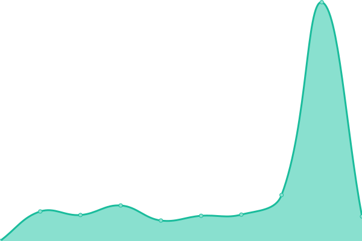
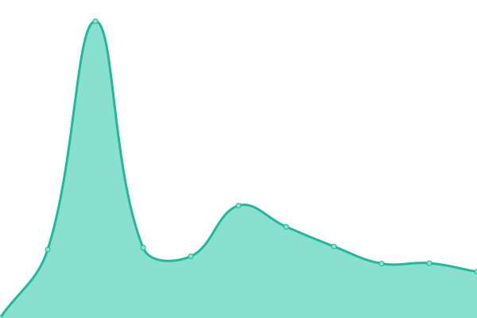
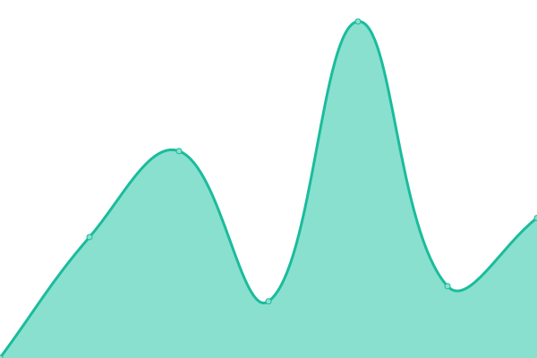

# [📈 Live Status](https://uptime.taj.f5.si): <!--live status--> **🟧 Partial outage**

This repository contains the open-source uptime monitor and status page for [TazimanTK](https://uptime.taj.f5.si), powered by [Upptime](https://github.com/upptime/upptime).

With [Upptime](https://upptime.js.org), you can get your own unlimited and free uptime monitor and status page, powered entirely by a GitHub repository. We use [Issues](https://github.com/TazimanTK/upptime/issues) as incident reports, [Actions](https://github.com/TazimanTK/upptime/actions) as uptime monitors, and [Pages](https://uptime.taj.f5.si) for the status page.

<!--start: status pages-->
<!-- This summary is generated by Upptime (https://github.com/upptime/upptime) -->
<!-- Do not edit this manually, your changes will be overwritten -->
<!-- prettier-ignore -->
| URL | Status | History | Response Time | Uptime |
| --- | ------ | ------- | ------------- | ------ |
|  [MainPage](https://taj.f5.si/) | 🟩 Up | [main-page.yml](https://github.com/TazimanTK/uptime/commits/HEAD/history/main-page.yml) | 

 2053ms
     
 | 

<a href="https://uptime.taj.f5.si/history/main-page">58.47%</a>
    

|  [Uptime](https://uptime.taj.f5.si/) | 🟩 Up | [uptime.yml](https://github.com/TazimanTK/uptime/commits/HEAD/history/uptime.yml) | 

 258ms
     
 | 

<a href="https://uptime.taj.f5.si/history/uptime">86.61%</a>
    

|  [Invidious](https://invidious.taj.f5.si/) | 🟩 Up | [invidious.yml](https://github.com/TazimanTK/uptime/commits/HEAD/history/invidious.yml) | 

 1989ms
     
 | 

<a href="https://uptime.taj.f5.si/history/invidious">48.25%</a>
    

|  [InvidiousInstances](https://invidious-instances.taj.f5.si/) | 🟥 Down | [invidious-instances.yml](https://github.com/TazimanTK/uptime/commits/HEAD/history/invidious-instances.yml) | 

 1695ms
     
 | 

<a href="https://uptime.taj.f5.si/history/invidious-instances">57.80%</a>
    

|  [Piped](https://piped.taj.f5.si/) | 🟥 Down | [piped.yml](https://github.com/TazimanTK/uptime/commits/HEAD/history/piped.yml) | 

 1293ms
     
 | 

<a href="https://uptime.taj.f5.si/history/piped">57.81%</a>
    

|  [CloudTube](https://cloudtube.taj.f5.si/) | 🟥 Down | [cloud-tube.yml](https://github.com/TazimanTK/uptime/commits/HEAD/history/cloud-tube.yml) | 

 1396ms
     
 | 

<a href="https://uptime.taj.f5.si/history/cloud-tube">32.18%</a>
    

|  [LibreX](https://librex.taj.f5.si/) | 🟥 Down | [libre-x.yml](https://github.com/TazimanTK/uptime/commits/HEAD/history/libre-x.yml) | 

 650ms
     
 | 

<a href="https://uptime.taj.f5.si/history/libre-x">18.92%</a>
    

|  [Cobalt](https://cobalt.taj.f5.si/) | 🟥 Down | [cobalt.yml](https://github.com/TazimanTK/uptime/commits/HEAD/history/cobalt.yml) | 

 664ms
     
 | 

<a href="https://uptime.taj.f5.si/history/cobalt">46.44%</a>
    

|  [Farside](https://farside.tazimantk.mydns.jp/) | 🟥 Down | [farside.yml](https://github.com/TazimanTK/uptime/commits/HEAD/history/farside.yml) | 

 0ms
     
 | 

<a href="https://uptime.taj.f5.si/history/farside">0.00%</a>
    

<!--end: status pages-->

[**Visit our status website →**](https://uptime.taj.f5.si)

## 📄 License

- Powered by: [Upptime](https://github.com/upptime/upptime)
- Code: [MIT](./LICENSE) © [Anand Chowdhary](https://anandchowdhary.com), supported by [Pabio](https://pabio.com)
- Data in the `./history` directory: [Open Database License](https://opendatacommons.org/licenses/odbl/1-0/)
